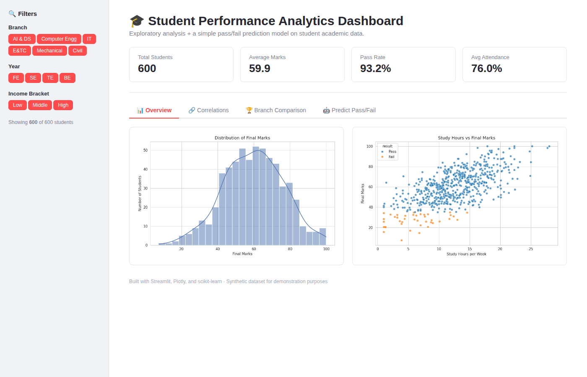

# 🎓 Student Performance Analytics Dashboard

An end-to-end data analytics project: synthetic data generation → exploratory data analysis → interactive dashboard → a baseline ML model, built with **Python, Pandas, Plotly, Streamlit, and scikit-learn**.


## 📌 What this project does

- Generates a realistic student performance dataset (600 records) with features like study hours, attendance, extracurricular load, income bracket, and subject-wise marks
- Runs exploratory data analysis (distributions, correlations, branch-wise comparisons) and saves static charts
- Serves an interactive **Streamlit dashboard** with filters, KPIs, and drill-down visualizations
- Trains a **Logistic Regression** model to predict Pass/Fail from study habits, with a live "try it yourself" predictor in the dashboard

## 🗂️ Project structure

```
student-performance-dashboard/
├── data/
│   └── student_data.csv        # generated dataset
├── visuals/                    # static EDA chart outputs (PNG)
├── generate_data.py            # creates the synthetic dataset
├── analysis.py                 # EDA script, saves charts to visuals/
├── app.py                      # Streamlit dashboard (main deliverable)
├── requirements.txt
└── README.md
```

## 🚀 How to run

```bash
# 1. Clone the repo and enter the folder
git clone <your-repo-url>
cd student-performance-dashboard

# 2. Install dependencies
pip install -r requirements.txt

# 3. (Optional) regenerate the dataset
python generate_data.py

# 4. (Optional) run static EDA and save charts
python analysis.py

# 5. Launch the interactive dashboard
streamlit run app.py
```

The dashboard opens at `http://localhost:8501`.

## 📊 Dashboard features

- **Filters** — branch, year, income bracket
- **Overview tab** — marks distribution, grade distribution, study hours vs marks scatter
- **Correlations tab** — heatmap of numeric features, marks by income bracket
- **Branch Comparison tab** — average marks by branch, subject-wise breakdown
- **Predict Pass/Fail tab** — model accuracy, confusion matrix, and live sliders to test predictions

## 🧠 Key insights from the analysis

- Study hours per week and attendance % are the strongest positive predictors of final marks
- Excessive extracurricular load shows a mild negative correlation with marks
- The logistic regression baseline achieves ~93-95% accuracy predicting pass/fail from just 3 features

## 🛠️ Tech stack

`Python` · `Pandas` · `NumPy` · `Matplotlib` / `Seaborn` (static EDA) · `Plotly` (interactive charts) · `Streamlit` (dashboard) · `scikit-learn` (ML model)

## 📝 Note on data

The dataset used here is **synthetically generated** (see `generate_data.py`) to demonstrate the analytics workflow end-to-end. The generation logic encodes realistic relationships (e.g., study hours and attendance positively affecting marks) so the EDA and model results are meaningful, but this is not real student data.

---
*Built as a data analytics portfolio project.*
